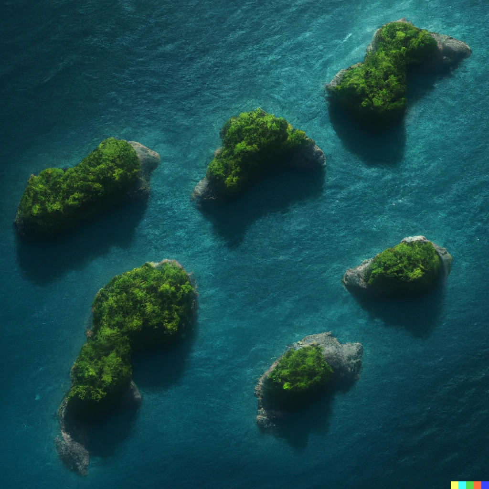
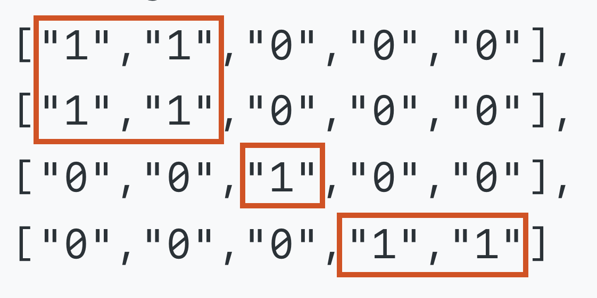

# Mange øyer

    <figure align="center">
        
        <figcaption><i>Hentet fra DALL-E 2.</i></figcaption>
    </figure>

I den vedlagte [tekstfilen](kart.txt) får du et `m x n` binært rutenett som representerer et kart over øyer, hvor `1` er land og `0` er vann. Finn ut hvor mange forskjellige øyer kartet inneholder.

Ruter med land som er koblet sammen hotisontalt eller vertikalt utgjør en øy. Hvis to ruter med land står diagonalt ovenfor hverandre så teller det som 2 øyer. Du kan anta at alt utafor kartet er vann. 

*Eksempel:* 

Dette kartet består av 3 øyer (en rød rute representerer 3 øyer).

---

    
Svar

    Kartet i tekstfilen består av 13 øyer!

