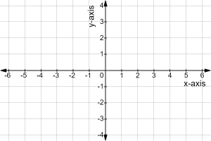

# Robotgressklipper på rømmen

Du våkner en varm sommerdag, lager deg en god kopp V60-kaffe og går ut på terrassen i morgenkåpen. Det romantiske morgenen blir raskt avbrutt da du ser på plenen. Gresset er jo sykt høyt!!!! Det kan ikke stemme, du har jo en trofast robotgressklipper til 10k som skal sørge for at akkurat dette ikke skjer. Hvor er den drittmaskinen??? Du begynner å speide i hagen og ser hullet i gjerdet der roboten har unsluppet. Det er helt umulig å si hvor roboten har tatt ferden, men du kommer raskt på at du har tilgang til bevegelsesloggen i skyen og løper inn for å laste den ned. The hunt is on!


## Mission: Stopp den klipperen

I denne mappen ligger det en logg over bevegelsene til roboten. Hver linje inneholder én av tre bevelgelser:
- `turn right`
- `turn left`
- `forwards [X]`

Loggen starter fra da roboten sist var på ladestasjonen, posisjon `(0,0)`. Retningen den ser mot da er mot positiv y. Når den snur vil den alltid snu 90 grader.



Eksepler på logg:
```
forwards 10
```
Denne loggen vil ta roboten til `(0,10)`

```
turn right
forwards 5
```
Denne loggen vil ta roboten til `(5,0)`

```
turn left
forwards 3
turn left
forwards 4
forwards 2
turn right
forwards 1
```
Denne loggen vil ta roboten til `(-4,-6)`

Hva er posisjonen til roboten når etter `logg.txt` er ferdig?

<details>
    <summary>Svar</summary>
    (-127, 121)
</details>