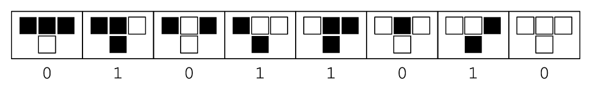
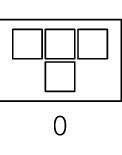
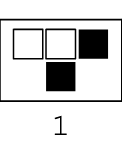
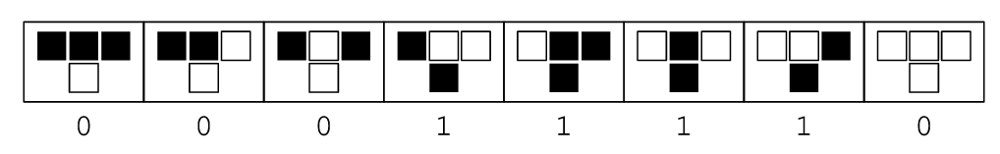

# [Vanskelig] Sierpińskitegning

Denne oppgaven går ut på å tegne en Sierpińskitrekant på en litt spesiell måte


Utgangspunktet vårt er den øverste rekken med piksler. Hver piksel er enten svart eller hvit. Si at 0 er hvit og 1 er svart.

```
000010000
```

For å kalkulere neste rad med piksler, ser du på forrige rad og regner ut hver piksel med følgende regler:



Pikselen bestemmes av de tre pikslene over. 

For eksempel, første piksel i neste rekke vil følge den siste regelen og være tom (Vi går ut ifra at pikslene utenfor kanten er `0`).



```
000010000
0
```

Andre og tredje vil følge samme regel

```
000010000
000
```

Men nå ser vi at de tre pikslene over den fjerde pikselen er `001`, det følger regelen nest lengst til venstre.



Den komplette neste raden er:

```
000010000
000101000
```

Sånn fortsetter det helt til man ikke gidder lenger. Etter fem linjer, ser tegningen sånn ut:

```
000010000
000101000
001000100
010101010
100000001
```

Om vi kun tegner de "svarte" pikslene ser vi starten på en sierpińskitrekant.

```
    1    
   1 1   
  1   1  
 1 1 1 1 
1       1
```

## Oppgave: Tegn en Sierpińskytrekant

Lag et program som tar inn et tall n som argument, og tegner en trekant på n rader ifølge reglene over. Første rad blir da kun én svart piksel omringet av n-1 hvite på hver side. (Eksepelet over har n=5 og starter med `000010000`)

Et tips er at hver piksel er en XOR av de to pikslene på skrått over.

```
abc
def
```

Her er `e` en XOR av `a` og `c`

## Ekstraoppgave: Alle reglene

Dette er bare én av de 256 reglene, nemlig regel 90. Man kan tolke hver regel som et siffer i et binærtall, og da ser du at tallet for dette settet er 01011010 = 90

.

Her ser du for eksempel regel 30, som vil danne et annerledes mønser



Endre programmet til å ta inn et tall r mellom 0 og 255 i tillegg til n. r skal bestemme hvilken regel som skal følges. Mer info finner du [her](https://mathworld.wolfram.com/ElementaryCellularAutomaton.html)